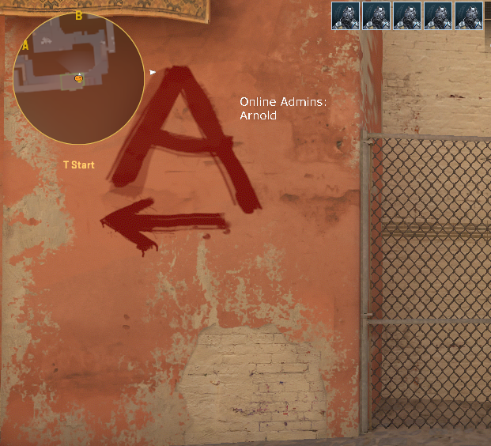

# OnlineAdmins


Displays a list of online admins on the screen.

# Command
`!admins`

# Requirements
[CounterStrikeSharp](https://github.com/roflmuffin/CounterStrikeSharp)

[CS2-GameHUD](https://github.com/darkerz7/CS2-GameHUD/tree/main)


# Instalation
- Download the latest release from [OnlineAdmins](https://github.com/M1Kac/OnlineAdmins/releases)
- Extract the .zip file into `addons/counterstrikesharp/plugins`
- Enjoy



### Configuration

Configuration file generated on addons/counterstrikesharp/configs/plugins/OnlineAdmins/OnlineAdmins.json
```json
{
  "AdminFlag": "css/generic", // Admin flag
  "Time": 10, // 10 seconds hud duration
  "HudColor": "White",
  "ConfigVersion": 1
}
```
